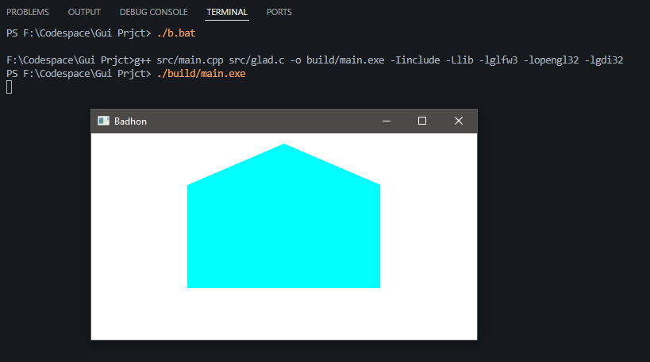

# OpenGL-House-Demo

This project demonstrates a simple house shape rendered using OpenGL, GLFW, and GLAD. The house consists of a cyan square (body) and a red triangle (roof).

## Features

- Renders a square and triangle using modern OpenGL (3.3 core profile)
- Uses GLFW for window/context management
- Uses GLAD for OpenGL function loading
- Press **B** to exit the application

## Requirements

- C++ compiler
- [GLFW](https://www.glfw.org/)
- [GLAD](https://glad.dav1d.de/)
- OpenGL 3.3 or higher

## Build & Run

1. Clone the repository:
   ```sh
   git clone https://github.com/your-username/OpenGL-House-Demo.git
   cd OpenGL-House-Demo
   ```

2. Make sure you have GLFW and GLAD set up in your project.

3. Compile and run:
   ```sh
   g++ src/main.cpp -o house -lglfw3 -lopengl32 -lgdi32
   .\house
   ```

   *(Adjust the command for your environment and library paths.)*

## Controls

- **B**: Exit the window


Output:
